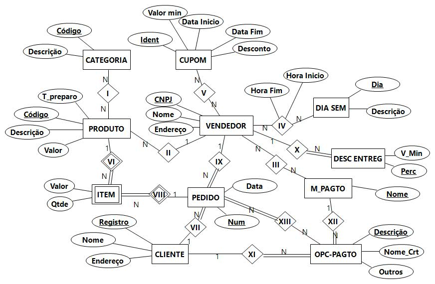

## [Tópico T29] - Modelo Entidade Relacionamento (MER) - DB Delivery: Requisitos de dados
###### *by Prof. Plinio Sa Leitao-Junior (INF/UFG)*

### Perfis de interesse (user profiles)

Cliente
Fornecedor
Entregador
Financeira

### Demanda Informacional

#### Cliente

1. Quais os métodos de pagamento de certo vendedor?
1. Quais os vendedores para certa categoria de produtos?
1. Quais as categorias de produtos?
1. Qual o tempo previsto para a entrega de certo pedido?
1. Quais vendedores de certa categoria de produtos recebem pedidos em certo horário?
1. Quais os cupons de desconto disponíveis para certos vendedores?
1. Quais os vendedores com entrega grátis?
1. Quais as avaliações de um certo vendedor?
1. Quais os vendedores e preços de determinado produto, incluindo a entrega?
1. Qual o histórico de pedidos?

#### Fornecedor

1. Quais os produtos disponíveis para entrega?
1. Quais as avaliações dos mesus clientes?
1. Qual o faturamento em certo período?
1. Que entregas foram realizadas dentro do tempo previsto?
1. Quais bairros com maior volume de entregas?
1. Quais os pedidos em andamento? 

#### Entregador

1. Quantas entregas em determinado período?
1. Qual a média de entregas em finais de semana?
1.

#### Financeira

1. Qual a remuneração acordada com cada fornecedor?

### Esquema conceitual para as demandas "Cliente"

### Esquema logico para as demandas "Cliente"

Clique [AQUI](../media/aifome-logico.pdf)
