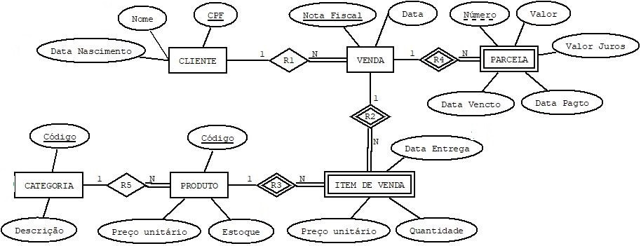

## Resultado

Clique [AQUI](../media/bd-2022-2-bec-resumo.pdf) para ver as notas.

#### Avaliação em 25/10/2022
Conforme enunciado da questão, a definição de banco de dados ser tal que "englobe o conteúdo das seis definições apresentadas". Nesse sentido, a definição deve mencionar: conjunto de dados; dados relacionados entre si; dados operacionais (reflete a dinâmica de algum domínio); dados armazenados (os dados são retidos/guardados, pois possuem valor); dados usados (há audiência, o que inclui o uso de sistemas/aplicações).

#### Avaliação em 01/11/2022
Em nosso curso buscamos adotar a terminologia posta no livro de referência [1]: (i) Modelo de dados – um conjunto de conceitos usados para descrever a estrutura e restrições do banco de dados; e (ii) Esquema de dados – a descrição em si da estrutura e restrições do banco de dados. Noutras palavras, modelos de dados guiam o projetista sobre que conceitos aplicar para elaborar (desenvolver) o esquema do banco de dados. 

#### Avaliação em 08/11/2022
É correto afirmar que: Um livro pode ser emprestado várias vezes para uma mesma pessoa; **Identificador** em PESSOA pode ter valor nulo; **Numero** em AUTOR deve ser único entre as _tuplas_ da relação; A informação "a quantidade de dias de atraso dos empréstimos devolvidos com atraso" pode ser obtida a partir do banco de dados.

#### Avaliação em 22/11/2022
1. RESUMO_AUTORIA (Numero, Qtde) ← Numero ℑ CONTA Numero ( AUTORIA ) RESULTADO ← π Nome ( AUTOR * σ Qtde>1 ( RESUMO_AUTORIA ) )
1. SEM_EMPRESTIMO (ISBN) ← π ISBN ( LIVRO ) – π ISBN ( EMPRESTIMO ) RESULTADO ← π Titulo ( LIVRO * SEM_EMPRESTIMO )

#### Avaliação em 29/11/2022
Clique [aqui](https://github.com/plinioleitao/bd-2022-2-bec/blob/main/data/bar.relax) para ter um _script RelaX_ do banco de dados.
1. TEMP ← π Cerveja (σ Bar='Pipoca' (VENDE) ) RESULT ← π Pessoa ( GOSTA * TEMP ) **Sintaxe RelaX:** TEMP = π Cerveja (σ Bar='Pipoca' (VENDE) ) π Pessoa ( GOSTA ⨝ TEMP )
  1. TEMP ← π Cerveja (σ Bar='Pipoca' (VENDE) ) TEMP2 ← π Pessoa ( GOSTA * TEMP ) RESULT ← π Pessoa (GOSTA) - TEMP2 **Sintaxe Relax:** TEMP = π Cerveja (σ Bar='Pipoca' (VENDE) ) TEMP2 = π Pessoa ( GOSTA ⨝ TEMP ) π Pessoa (GOSTA) - TEMP2
1. TEMP ← π Cerveja (VENDE) - π Cerveja (σ Bar='Pipoca' (VENDE)) TEMP2 ← π Pessoa ( GOSTA * TEMP ) RESULT ← π Pessoa (GOSTA) - TEMP2 **Sintaxe Relax:** TEMP = π Cerveja (VENDE) - π Cerveja (σ Bar='Pipoca' (VENDE)) TEMP2 = π Pessoa ( GOSTA ⨝ TEMP ) π Pessoa (GOSTA) - TEMP2

#### Avaliação em 06/12/2022
1. Se seu primeiro nome for **_PEDRO_**: SELECT Nome_dependente, Pnome, Unome FROM DEPENDENTE JOIN FUNCIONARIO &nbsp;&nbsp;&nbsp;&nbsp;&nbsp;&nbsp;&nbsp;&nbsp;&nbsp;&nbsp;&nbsp;&nbsp;ON Fcpf = Cpf WHERE ( Nome_dependente LIKE "PE%" OR Pnome LIKE "PE%" ) AND&nbsp;&nbsp;&nbsp;&nbsp;&nbsp;( Nome_dependente LIKE "%RO" OR Pnome LIKE "%RO" ) AND&nbsp;&nbsp;&nbsp;&nbsp;&nbsp;( CHAR_LENGTH(Nome_dependente) = CHAR_LENGTH("PEDRO") OR &nbsp;&nbsp;&nbsp;&nbsp;&nbsp;&nbsp;&nbsp;&nbsp;&nbsp;&nbsp;&nbsp;&nbsp;&nbsp;&nbsp;&nbsp;CHAR_LENGTH(Pnome) = CHAR_LENGTH("PEDRO") )

#### Avaliação em 13/12/2022
1. SELECT AUTOR.Numero, AUTOR.Nome FROM AUTOR NATURAL JOIN AUTORIA GROUP BY AUTOR.Numero, AUTOR.Nome HAVING COUNT(\*) > 1
2. SELECT LIVRO.ISBN, LIVRO.Titulo FROM LIVRO NATURAL JOIN EMPRESTIMO GROUP BY LIVRO.ISBN, LIVRO.Titulo HAVING COUNT(\*) > 1 WHERE EMPRESTIMO.DataFinalReal IS NULL

#### Avaliação em 20/12/2022
1. SELECT Pnome, Unome FROM FUNCIONARIO WHERE CPF IN ( SELECT Fcpf FROM DEPENDENTE GROUP BY Fcpf HAVING COUNT(\*) > 1 INTERSECT SELECT Fcpf FROM TRABALHA_PARA GROUP BY Fcpf HAVING COUNT(\*) > 1 )
2. (C1): 01 _tupla(s)_ ; (C2): 02 _tupla(s)_ ; (C3): 02 _tupla(s)_

#### Avaliação em 17/01/2022
1. SELECT Pnome, Unome FROM FUNCIONARIO WHERE ( &nbsp;&nbsp;&nbsp;&nbsp;**SELECT COUNT(\*)** &nbsp;&nbsp;&nbsp;&nbsp;**FROM TRABALHA_EM** &nbsp;&nbsp;&nbsp;&nbsp;**WHERE FUNCIONARIO.Cpf = TRABALHA_EM.Fcpf** ) &nbsp;&nbsp;&nbsp;&nbsp;&nbsp;&nbsp;&nbsp;&nbsp;&nbsp;&nbsp;&nbsp;&nbsp;IN (1, 4)
2. SELECT Pnome, Unome, Salario FROM FUNCIONARIO WHERE Salario <= ALL  ( &nbsp;&nbsp;&nbsp;&nbsp;**SELECT Salario** &nbsp;&nbsp;&nbsp;&nbsp;&nbsp;&nbsp;&nbsp;&nbsp;**FROM FUNCIONARIO** )

#### Avaliação em 31/01/2022
Uma proposta de solução abaixo: 

#### Avaliação em 14/02/2022
1. 07
2. 03
3. 06
4. 04
5. Sugestão abaixo.

#### Bibliografia
[1] ELMASRI, R.; NAVATHE, S. B. Sistemas de Banco de Dados. 6. ed. Pearson, 2011.
